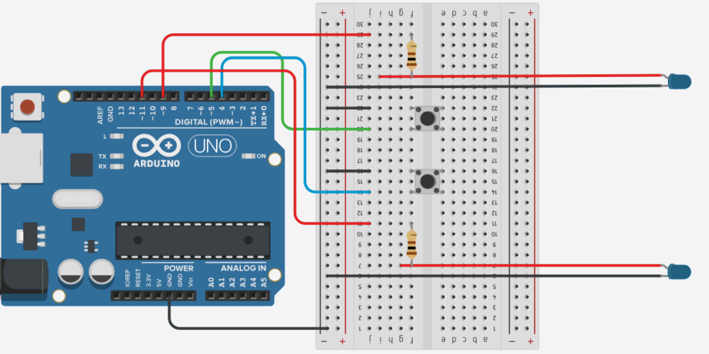

# Experimento Monga - Códigos Arduino

Bem-vindo ao repositório do **Experimento Monga**, onde você encontrará todos os códigos Arduino utilizados para automatizar a iluminação e reproduzir a ilusão óptica do *Fantasma de Pepper*.  

Este projeto é parte de uma proposta didática que integra **Robótica** e **Óptica**, ideal para atividades do Novo Ensino Médio e projetos de feiras de Ciências.  

---

## Arduino + Potenciômetro

Diagrama do Circuito mostrando as Ligações:

Simulação no Tinkercad:
   - [Simulador no Tinkercad](https://www.tinkercad.com/things/20kknMUIpUK-iluminacao-usando-potenciometro?sharecode=ai6lIu64ALiIXyDZuIvr-SprHF9KPNWgTUGGUGX8-G0)

Código principal para controle da iluminação usando potenciômetro:
  - [Arduino + Potenciômetro](Potenciometro.ino)
    
Materiais necessários

  - Arduino Uno;
  - Potenciômetro 10 kΩ;
  - 2 LEDs brancos de alto brilho;
  - 2 Resistores 100 Ω;
  - Fios e protoboard.

---

## Arduino + Push Button

Diagrama do Circuito mostrando as Ligações:

Simulação no Tinkercad:
   - [Simulador no Tinkercad](https://www.tinkercad.com/things/ecqbcfPI4kx-iluminacao-usando-botoes?sharecode=g_ROvi8XSsJWS0bv11aLcfOx-4Wxsi0TJ9ZxMI3u-Kg)

Código principal para controle da iluminação usando potenciômetro:
  - [Arduino + Push Button](bot.ino)
    
Materiais necessários

  - Arduino Uno;
  - 2 Push Button;
  - 2 LEDs brancos de alto brilho;
  - 2 Resistores 100 Ω;
  - Fios e protoboard.

## Referências

- [Tinkercad](https://www.tinkercad.com/dashboard) — Simulação de circuitos e prototipagem virtual.
- [Artigo]() — Artigo em espera.

---

**Divirta-se aprendendo e explorando a Física com Robótica!**
