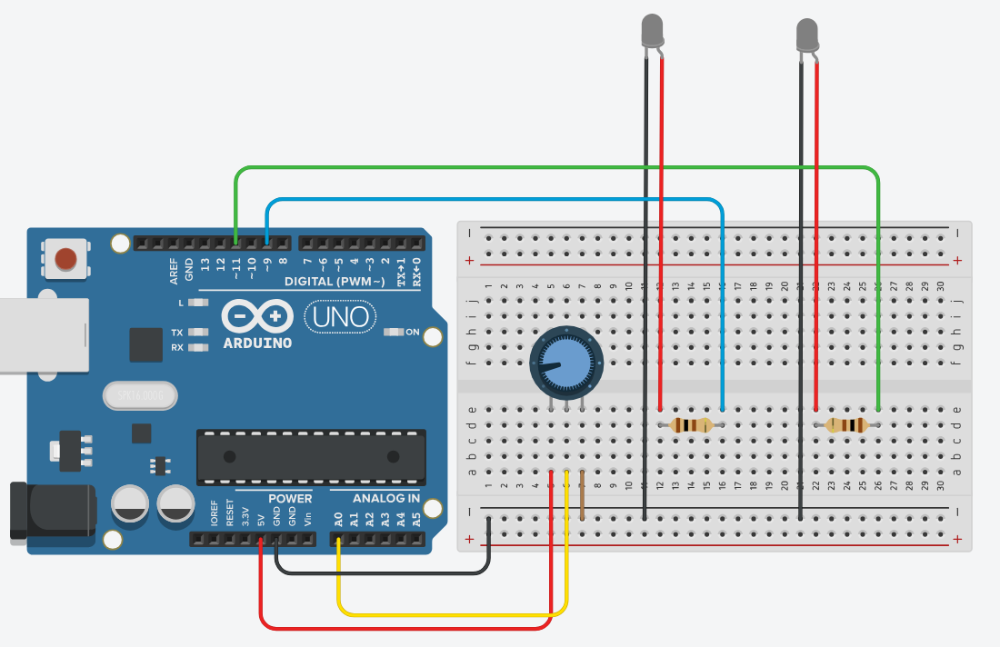

# Experimento Monga - Códigos Arduino

Bem-vindo ao repositório do **Experimento Monga**, onde você encontrará todos os códigos Arduino utilizados para automatizar a iluminação e reproduzir a ilusão óptica do *Fantasma de Pepper*.  

Este projeto é parte de uma proposta didática que integra **Robótica** e **Óptica**, ideal para atividades do Novo Ensino Médio e projetos de feiras de Ciências.  

---

## Arduino + Potenciômetro

Diagrama do Circuito mostrando as Ligações:

Código principal para controle da iluminação usando potenciômetro:

  - [Arduino + Potenciômetro](Potenciometro.ino)
    
Materiais necessários

  - Arduino Uno;
  - Potenciômetro 10 kΩ;
  - 2 LEDs brancos de alto brilho;
  - Resistores 100 Ω;
  - Fios e protoboard.

## Materiais necessários

- Arduino Uno (ou compatível)
- Potenciômetro
- LEDs
- Resistores
- Fios e protoboard
- Estrutura do experimento (isopor, acrílico ou outro material)
- Computador com Arduino IDE instalada

> Dica: Muitos dos materiais eletrônicos já estão disponíveis nos **kits de Robótica** fornecidos pelo estado.

---

## Como usar

1. Abra o Arduino IDE.
2. Conecte o Arduino ao computador.
3. Abra o arquivo `ControleIluminacao.ino`.
4. Faça o upload do código para o Arduino.
5. Monte o circuito conforme o diagrama em `/Documentacao/EsquemaCircuito.pdf`.
6. Ajuste o potenciômetro para controlar a intensidade da iluminação e observar o efeito Monga.

---

## Licença

Este projeto está licenciado sob a [Licença Creative Commons - Atribuição-NãoComercial-SemDerivações 4.0 Internacional](https://creativecommons.org/licenses/by-nc-nd/4.0/).  

---

## Referências

- [Tinkercad](https://www.tinkercad.com/dashboard) — Simulação de circuitos e prototipagem virtual.
- [Robótica Paraná](https://www.seed.pr.gov.br) — Kits de robótica utilizados nas escolas.
- Artigos e materiais didáticos sobre o Fantasma de Pepper e óptica aplicada em sala de aula.

---

**Divirta-se aprendendo e explorando a Física com Robótica!**
